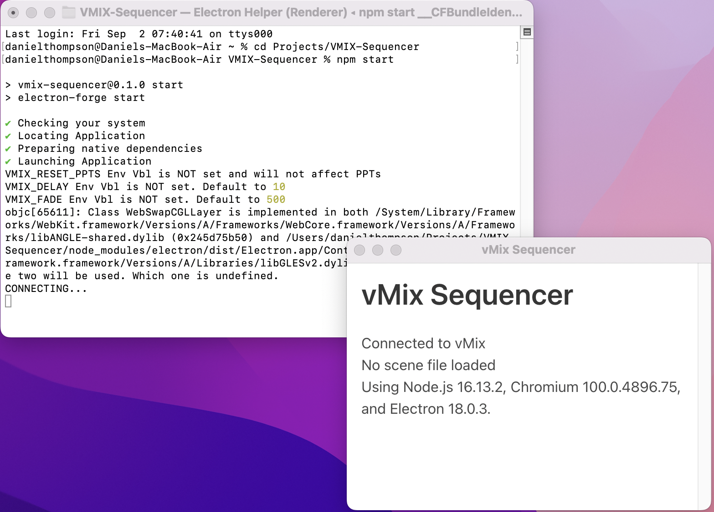
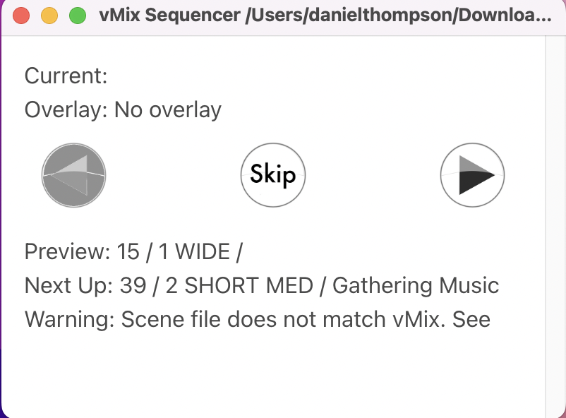
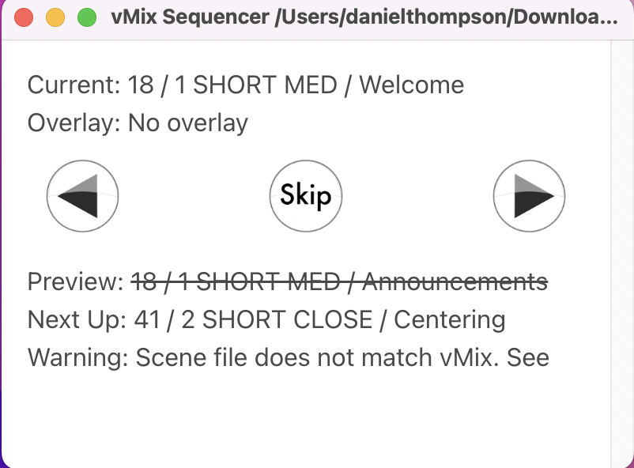

# vmix-sequencer
One of a series of utilities used to streamline running vMix broadcasts.

vMix Sequencer uses an Excel Spreadsheet to sequence the scenes in a vMix video presentation. In the current version it looks at columns B and D for scene information and compares these to what’s in vMix.

### Installing
1. npm install
2. Edit sequencer.bat to set the enviroment variables how you need them
3. Dreate a desktop shortcut to sequencer.bat
4. Create a folder called This Week's Service on the desktop

### Environment Variables:
- VMIX_RESET_PPTS if set will rewind all powerpoints to their first slide. Default false
- VMIX_FADE is the fade time in milliseconds. Default 500
- VMIX_DELAY is the delay in millisedconds between vMix commands. Default 10
- VMIX_INPUTNUMBERCOLUMN the Excel spreadsheet column that has the Input Number. Default B
- VMIX_SHORTTITLECOLUMN the Excel spreadsheet column that has the Input Short Title. Default D
- VMIX_DESCRIPTIONCOLUMN the Excel spreadsheet column that has the Input Description. Default E

### Sample Service Plan:
(https://docs.google.com/spreadsheets/d/13xECiBV6v-LLpTymAqeXwfklqHTHWoMlASFNHXhBSiM/edit?usp=sharing)

### Service Plan Requirements:
1. The sequencer will skip any row that does not have an Input Number. This lets you have comment lines in your service plan. 
2. If you're using multiple cameras the camera number it's a best practrice to have camera number be the first thing in the shortTitle, followed by the name of the shot, like "1 WIDE", or "2 PIANO"

### Steps to run
1. Download the current Service Plan from Google Drive to This Week’s Service folder on the Windows Despot as an Excel (XLSX) file.
2. Make sure vMix is started
3. Double Click the vMix Sequencer shortcut to start
4. When it comes up you should see two windows, the vMix Sequencer and a Log Screen window. You can minimized the Log Screen window.

 The vMix Sequencer tells you that you are 
 - Connected to vMix or not. 
 - It is waiting for a scene file (Excel spreadsheet). 
 - Other version information.
 
 
 5. From the File Menu, open the Excel spreadsheet. vMix Sequencer will change to look like this:

Each line shows the "Input Number / Short Title / Description" from that line of the Excel spreadsheet.

- Current:	Is the shot currently being output, at the beginning it is left blank
- Overlay:	Tells you there is an overlay. You must manage overlays on your own.
- Buttons:	Back, Skip, Forward
- Preview:	This tells you which shot is currently in preview
- Next Up:	This tells you what will be previewing next
- Warning:	This tells you the spreadsheet doesn’t match vMix. It’s a problem.
- Back Button: 	Moves back one row in the service plan
- Skip Button:	Ignores what’s in Preview and moves “Next Up” directly to Current.
- Fwd Button:	Does what you’d expect, moves Preview to Current

### Same PTZ Camera
If you see the Preview has a line through it, that means it is using the same PTZ camera as what is currently being displayed in output. It should be obvious that previewing the same PTZ camera with different PTZ settings than the one being shown will immediately affect the one being shown. The sequencer detects this situation and will not actually preview this shot. You have a choice to make here, You can either skip this slide entirely using the skip button, or you can go ahead and show the slide using the Forward button. The Back Button might give unexpected results when the same PTZ cammera uses different settings in two consecutive shots.

 
## Testing on non-vMix platforms, like MacOS 

I've provided a vMix stub utility that listens on the vMix port, making it possible to do development work on non-vMix platforms. All it does is listen on the port and print the vMix api queries to console.log.

npm test

